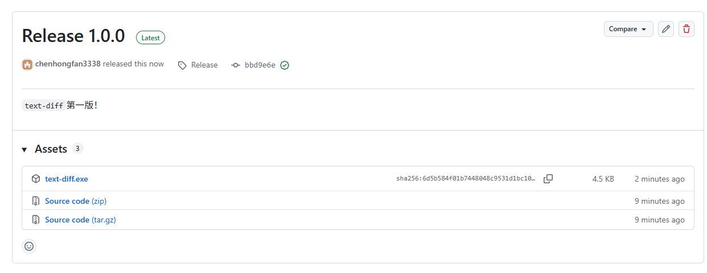

# text-diff
一定要翻到最后！！！
## 简介

一个文本文件内容比较工具。

## 如何使用

### 第一步
点击Releases。

### 第二步
你将会看到一个页面。单击“text-diff.exe”以下载。


### 第三步
下载后，运行指令。
```cmd
text-diff.exe <file1> <file2>
```
: 如果输出为：
```plaintext
Two files are equals!
```
则两个文件内容相等。否则，两个文件内容不相等。
## 何意味
点击项目右上角的Star按钮，谢谢！
## Star History

<a href="https://www.star-history.com/?repos=programmer-null%2Ftext-diff&type=date&legend=top-left">
 <picture>
   <source media="(prefers-color-scheme: dark)" srcset="https://api.star-history.com/chart?repos=programmer-null/text-diff&type=date&theme=dark&legend=top-left" />
   <source media="(prefers-color-scheme: light)" srcset="https://api.star-history.com/chart?repos=programmer-null/text-diff&type=date&legend=top-left" />
   
 </picture>
</a>
